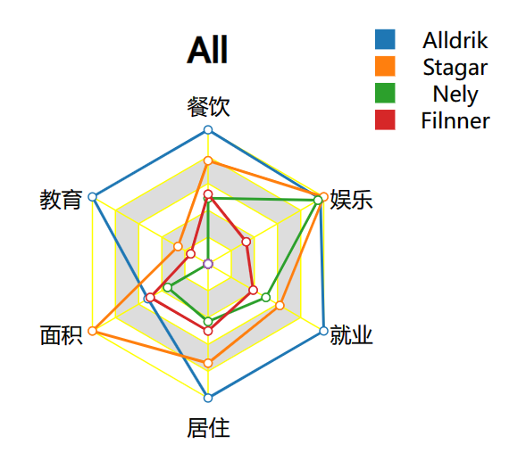
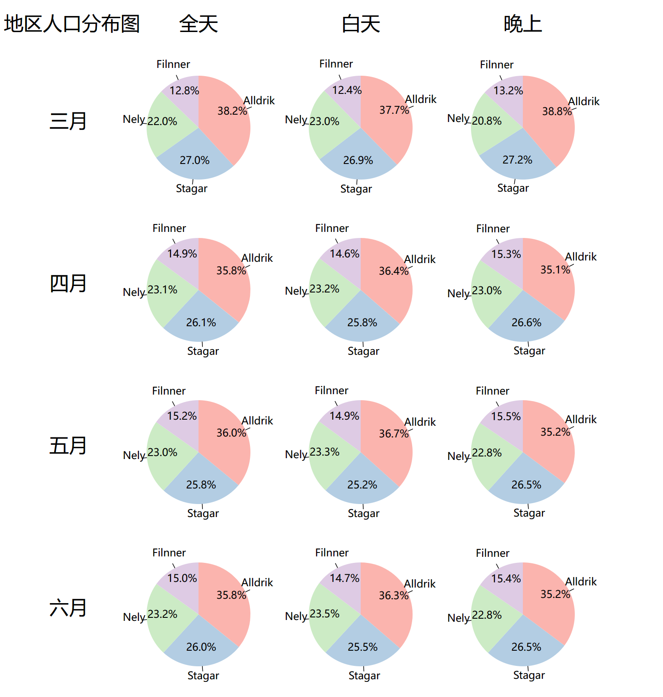

# 数据可视化期末报告
## 金毓淇 姚博远

## 0. 项目背景
我们组选择了问题2，着眼于整个城市的日常生活模式。

## 1. 问题1
### 1.1 概述
在问题1中，我们要将整个城市划分为几个不同的地理区域，并研究不同的地理区域的特征。因此，我按地理形状的特点将该城市分为了四个区域：Alldrik，Stagar，Nely，Filnner；并从不同的建筑物密度和人口密度两方面研究了各个地理区域的特征。
### 1.2 可视化系统描述
#### 1.2.0 系统概述
我们的可视化系统主要分为三个部分。第⼀部分是在城市的建筑地图的基础上将城市划分为了四个板块，并标注出了稀有建筑的位置，第⼆部分是用不同的建筑物密度来可视化了各个地理区域的特征，第三部分用不同时间范围下的人口量来可视化了各个地理区域的人口密度。
下面是总体图：

#### 1.2.1 地图可视化
在这个部分中，我们可视化了城市地图，在城市的地图的基础上将城市划分为了四个板块，并标注出了稀有建筑的位置，如下图可⻅：

可以从图中看出我们将整个城市划分为了：Alldrik，Stagar，Nely，Filnner 四个区域。并且从酒吧，餐厅和学校的分布密度中我们也可以猜测出Alldrik是相对比较繁华的一块区域，而Nely，Filnner则相对比较贫乏。

#### 1.2.2 地区特征可视化
在这个部分中，我们可视化了每个地区的特征，如下图所示：

下面先来阐述可视化该图的依据：

首先是统计每个地区的建筑物数量,然后将每个地区的Buildings数量估算为其地区的面积；用此面积去计算每个地区相对应的建筑物的密度，并将建筑物密度等比例相对地转化为建筑物对应特征的分数。最后再次观察最终得出的雷达图，可得到以下结论：总体上看Alldrik地区较为繁华，Stagar地区为中等水平，Nely和Filnner地区相对基础设施贫乏。
细致的来看：Alldrik地区除了面积不够大外，其余的特征分数均是十分优秀的；Stagar地区的面积和娱乐水平较高，而教育资源相对不足，其余的则中规中矩；Nely地区的娱乐水平相比于它的其它特征而言十分高，而其教育资源相当匮乏；Filnner则呈现出一个特征分数总体小一圈的状态，均衡地稍微欠缺一些基础设施的建设。

#### 1.2.3 地区人口密度可视化
在这个部分中，我们统计并可视化了每个月的白天和晚上，四个地区分别的人口密度

单一月份（3月）全天的人口密度的可视化结果图：

由于人口密度随时间变化不会特别大，因此可从该结果中可以看出人口密度由大到小依次为：Alldrik，Stagar，Nely，Filnner；该结果一定程度上也和上一板块中的繁荣程度想照应。

总可视化结果图：

由该图可看出两方面的地区人口特征：
首先是白天与晚上的对比，Filnner地区与Stagar地区较为明显地呈现出:晚上人口密度比白天多的特征，我们认为其原因是白天工作的人们会从这两个地区跑向其余地区，而晚上人们则会回家，这也与上一板块中Filnner地区与Stagar地区地就业特征分数较低相照应。

然后是观察不同月份的人口密度区别，可以发现三月份到四月份间，Alldrik地区的人口密度显著减少，而Filnner地区的人口密度则显著增加，我们推测这是一部分人民从Alldrik地区搬迁去了Filnner地区。从之前的结论可以看出，Alldrik地区已经开发的较为完善，而Filnner地区则是还处于有待开发的状态下，因此进行一部分的移民可以减少Alldrik地区较多的人口负担，并同时有助于Filnner地区的开发完善；这一特征也符合大部分城市的发展历程（例如上海曾经由浦西去往浦东发展的浪潮）。

#### 1.2.4 综述
结合以上的三个可视化部分，我们得出的结论是：
1.	从大体上来看，Alldrik地区开发较完善，人口密度高，地区繁华程度高；Stagar地区开发水平中等，人口密度中等，地区繁华程度中等；Nely地区开发水平低，人口密度中等，地区繁华程度低；Filnner地区开发水平低，人口密度低，地区繁华程度低。
2.	从细节上来看，Alldrik地区对于人们不同的特征需求都十分到位，但需要减少人口密度；Stagar地区其余资源比较均衡，但需要加强教育资源的倾注；Nely地区娱乐和餐饮资源与自身相比较为出色，但急需教育资源的投入；Filnner地区全方面的资源较为缺少，需要加强开发。
3.	城市疑似有意识地进行着降低Alldrik地区人口量，提升Filnner地区人口量的行动；旨在降低Alldrik地区人口密度的同时，增进Filnner地区的开发脚步。

## 2. 问题2
### 2.1 概述
在问题2中，我们要对两个有着不同日常活动的参与者可视化对比日常活动的模式。在这个问题上，我们挑选了Id为0和30的参与者作为对比双方，原因在于前者的财政状况一直非常的稳定，而后者在数据统计开始时财政状况不是非常稳定，导致二者在行为上有比较明显的差异。
### 2.2 可视化系统描述
#### 2.2.0 系统概述
我们的可视化系统主要分为四个部分，第一部分是在城市的建筑地图的基础上将参与者轨迹可视化，第二部分是可视化了参与者的预算情况（包括总预算和每周的额外预算），第三部分可视化了参与者的日常开销，第四部分可视化了参与者的日常状态（包括睡眠状态和位置状态）。这几个部分通过slider控件来控制显示的时间段（以天为单位）。
#### 2.2.1 地图可视化
在这个部分中，我们可视化了参与者在slider给出的日期下（注：使用UTC时间）用户当日的轨迹，并且标注了用户的住宅和上班地点，如下图可见

通过拖动slider指定不同的日期，我们可以看到参与者的生活轨迹主要和住宅和上班地点有关，在工作日当中，参与者的生活轨迹主要集中在住宅和上班地点之间，而在休息日当中，参与者的生活轨迹主要集中在住宅附近。其中参与者0的轨迹较为稳定，而参与者30的轨迹由于住宅和上班地点的变动在数据统计的前期较为不稳定，但是在工作和财政状况稳定下来后，参与者30的轨迹也变得较为稳定。同时，由于参与者30的上班日期并非往常的周一到周五，故参与者0和参与者30的轨迹周期变化有一个明显的差异。

#### 2.2.2 预算可视化
在这个部分中，我们可视化了两个参与者在数据统计周期内的预算变化，并且在slider给出的日期下高亮显示了当日的预算变化情况，如下图所示

我们可以看到，参与者0由于财政状况稳定，总预算和当周额外预算的变化都呈现一种稳定的模式，并且稳步上升。参与者30在前期的财政状况波动较大，但是在财政状况稳定后，总预算和当周额外预算的变化也呈现一种稳定的模式，并且稳步上升。同时，我们可以看到，参与者0和参与者30的总预算和当周额外预算的绝对值有加大的差距。

#### 2.2.3 开销可视化
在这个部分中，我们可视化了两个参与者在slider给定的日期下的日常开销情况（包括每日的开销和数据统计周期内各类型开销的占比），并且在关键的位置给出了悬浮窗展现详细信息，如下图所示

通过以上视图我们发现了参与者的开销模式的共性和不同。首先，两个参与者都会在每个月的第一天支付自己的房租，同时在工作日，参与者的工资一般都会进行两次发放，对应上午的工作时段和下午的工作时段。

两个参与者开销模式也有很多不同点。首先，同第一部分的观察，两个参与者不同的工作时间造成了开销模式周期的不同。其次，我们发现参与者30几乎在每个休息日都会有密集的娱乐活动，但是参与者0的娱乐活动则相对较少，一般两个礼拜（或以上）会出现一个娱乐活动的峰值。

#### 2.2.4 日常状态可视化
在这个部分中，我们可视化了两个参与者在slider给定的日期下的日常状态情况（睡眠状态和位置状态），并且在关键的位置给出了悬浮窗展现详细信息，如下图所示

我们通过不同日期下该视图的结果可以看到，两个参与者中，参与者0的睡眠时间更长，而且时常有一段准备入睡的时间，在睡眠上比参与者30更从容一些。由于参与者0的住所和工作地点较远，所以参与者0的通勤时间更长一些；参与者30的消遣娱乐时间更多。两人的共性则在于休息日的宅家行为，在没有娱乐安排的休息日，两人的宅家时间基本上都在20小时以上。

#### 2.2.5 综述
结合以上的四个可视化部分，我们得出的结论是：
1. 参与者0是一个更勤俭精打细算的人，生活也比较规律，娱乐活动相对比较不丰富，也因此积攒了不少的资金。
2. 参与者30是一个生活比较奢侈的人，在工资低于参与者0的情况下，还有更高频率的娱乐活动，因此积攒的资金比较少，更容易出现财政状况不稳定的情形。

## 3. 未来工作
本次项目的可视化部分还有很多可以改进的地方，比如：
1. 可以构建一个数据库后端进行数据管理，而不是在前端进行数据的读取和处理。
2. 可视化的交互和美观程度还可以进行一定程度的改善。
3. 可以改进一下数据的读取使用方式，提高网页渲染的性能。

## 4. 分工
- 金毓淇：项目第一部分的设计、实现和报告撰写
- 姚博远：项目第二部分的实际、实现和报告撰写，最终项目的整合